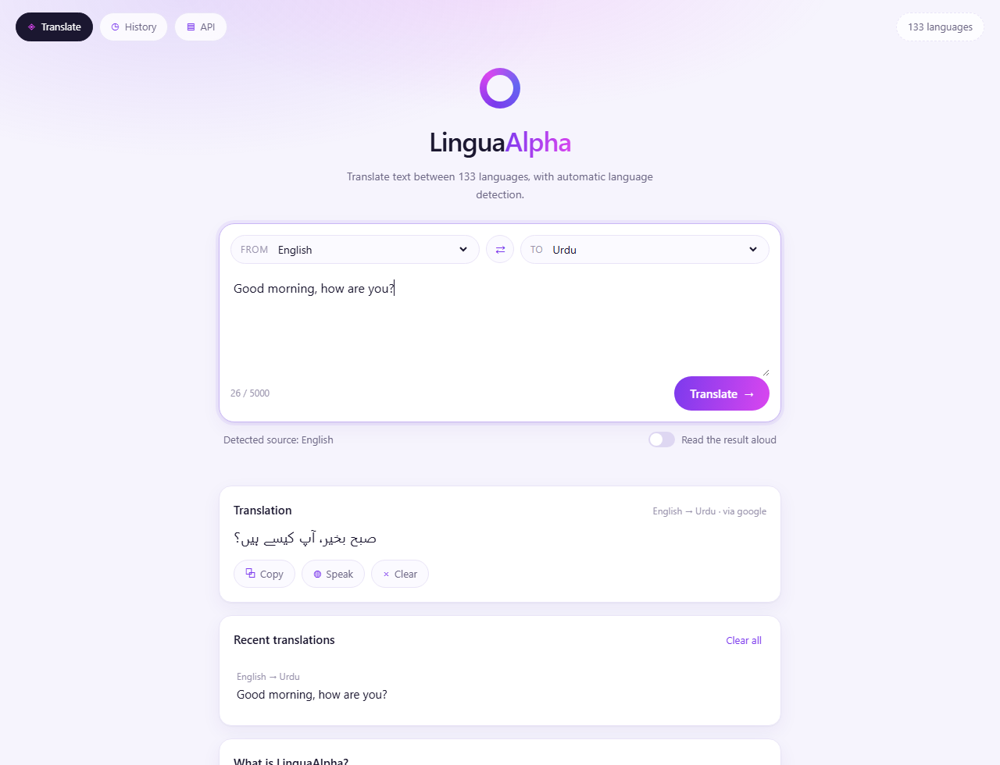
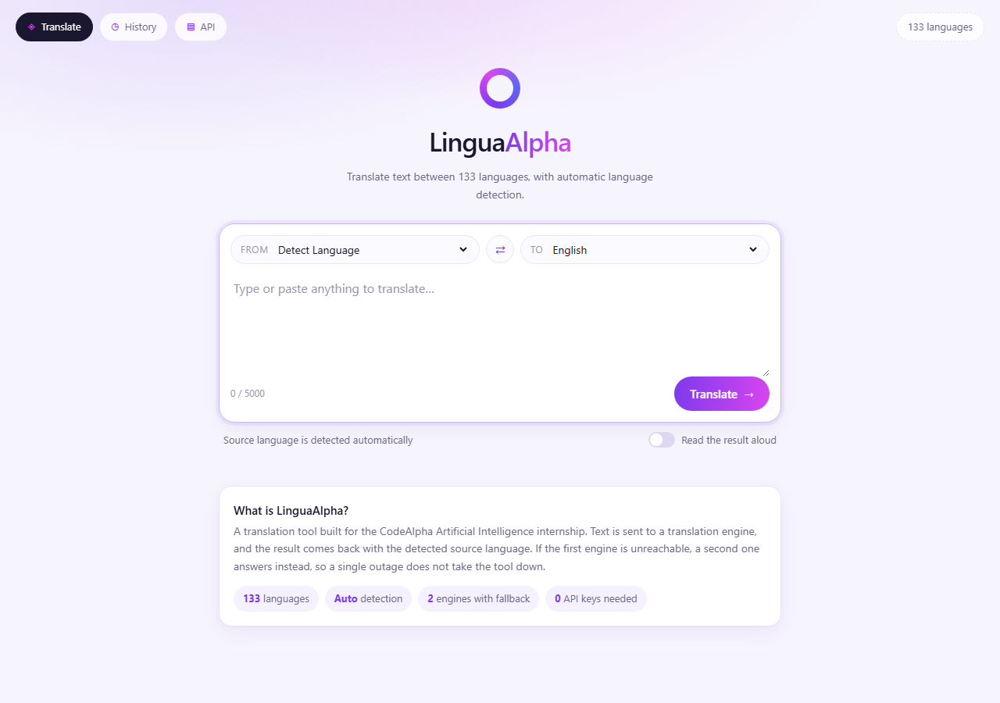

# CodeAlpha — Language Translation Tool

**Task 1 of the CodeAlpha Artificial Intelligence Internship**

A web app that translates text between **133 languages**. You type text, choose the source
and target language, and get the translation back — with automatic language detection, a
copy button, text-to-speech and a local history of what you translated.



   

---

## Table of contents

1. [What it does](#what-it-does)
2. [Quick start](#quick-start)
3. [How it works](#how-it-works)
4. [Why two translation engines](#why-two-translation-engines)
5. [API reference](#api-reference)
6. [Tests](#tests)
7. [Project layout](#project-layout)

---

## What it does

| Feature | Detail |
|---|---|
| 🌍 **133 languages** | The full Google Translate language set, bundled offline in `app/languages.json` |
| 🔍 **Auto-detect** | Leave the source on *Detect Language* and the response tells you what it found |
| 🔁 **Engine fallback** | Google first, MyMemory second, so one outage does not take the app down |
| ⚡ **Caching** | Repeat requests are served from an in-process LRU cache and never re-sent |
| 📋 **Copy** | One click puts the translation on your clipboard |
| 🔊 **Speak** | Browser text-to-speech reads the result in the target language |
| ⇄ **Swap** | Flips the two languages and moves the translation into the input box |
| 🕘 **History** | Your last six translations, kept in this browser only, click one to restore it |
| 🔗 **Deep links** | `/?text=Good%20morning&to=ur` opens with that translation already done |

### The interface

The empty state, before you type anything:



---

## Quick start

```bash
pip install -r requirements.txt
uvicorn app.main:app --reload
```

Open <http://127.0.0.1:8000>. No API key, no account and no configuration file are needed.

---

## How it works

```
Browser
   │  POST /api/translate  {"text": "...", "source": "auto", "target": "ur"}
   ▼
FastAPI  ──►  schemas.py      length 1..5000 characters, otherwise 422
   │
   ▼
translate()  ──►  validate both language codes against languages.json
   │              (unknown code → 422, "auto" as a target → 422)
   │
   ├─► LRU cache hit? ──► return immediately, no network call
   │
   ├─► google()    ──► clients5.google.com  ──► ("صبح بخیر", "en")
   │        │ fails (offline, rate limited, malformed reply)
   │        ▼
   └─► mymemory()  ──► api.mymemory.translated.net
            │ also fails
            ▼
       ProvidersUnavailable → 502 with the reason from every engine
```

### The modules, and why they are split this way

| File | Responsibility |
|---|---|
| `app/providers.py` | One function per translation engine. Every provider has the identical signature `(client, text, source, target) -> (translated_text, detected_source)`, so the service layer can loop over them without knowing which is which. |
| `app/translator.py` | The decision-making layer: validate the language codes, walk the providers in order, cache successful results, raise a specific error on failure. |
| `app/schemas.py` | The request and response shapes. Pydantic rejects bad input before any of our code runs. |
| `app/main.py` | HTTP only — routing, serving the UI, and mapping our exceptions onto status codes. |
| `app/static/` | The interface. No framework, no build step, no `node_modules`. |

Adding a third engine means writing one function and adding one line to the `PROVIDERS`
dictionary. Nothing else in the codebase changes.

### Errors are specific, not generic

The API distinguishes *your* mistake from *the engine's* failure, because the two need
different reactions from whoever is calling it:

| Situation | Exception | Status |
|---|---|---|
| Language code that does not exist | `UnsupportedLanguage` | **422** — fix the request |
| `auto` used as a *target* language | `UnsupportedLanguage` | **422** — you must say where to translate *to* |
| Text empty or over 5000 characters | pydantic validation | **422** |
| Every engine unreachable | `ProvidersUnavailable` | **502** — the request was fine, upstream was not |

---

## Why two translation engines

The obvious library for this task is `deep-translator`. It was the first thing tried here,
and it did not work: its Google scraper now receives **HTTP 500** from the endpoint it
depends on, so every translation failed with `TranslationNotFound`.

Rather than ship a broken dependency, the tool talks to the translation endpoints directly
with `httpx` — about forty lines — and keeps a second engine as backup:

| Engine | Endpoint | Auto-detect | Role |
|---|---|---|---|
| **Google** | `clients5.google.com/translate_a/t` | yes, returns the detected code | first choice |
| **MyMemory** | `api.mymemory.translated.net/get` | yes, via `Autodetect` | used when Google fails |

The language list itself was frozen into `app/languages.json` at build time, so the
dropdowns do not need a network call to populate, and the app no longer depends on
`deep-translator` at all.

---

## API reference

| Method | Endpoint | Description |
|---|---|---|
| `GET` | `/api/languages` | `{code: name}` for every supported language |
| `POST` | `/api/translate` | Translate a block of text |
| `GET` | `/docs` | Interactive OpenAPI documentation |

```bash
curl -X POST http://127.0.0.1:8000/api/translate \
  -H "Content-Type: application/json" \
  -d '{"text": "Good morning, how are you?", "source": "auto", "target": "ur"}'
```

```json
{
  "text": "صبح بخیر، آپ کیسے ہیں؟",
  "source": "en",
  "target": "ur",
  "provider": "google"
}
```

`source` in the response is the **detected** language, which is how the interface can show
"Detected source: English" after an auto-detected translation. `provider` names the engine
that actually answered, so a fallback is visible rather than silent.

---

## Tests

```bash
pytest
```

**16 tests, all offline.** The network is replaced by `httpx.MockTransport` and scripted
provider functions, so the suite is deterministic and finishes in about two seconds.

| File | Covers |
|---|---|
| `tests/test_providers.py` | Both response shapes Google returns, empty payloads, HTTP 429, MyMemory's "success" body that actually reports an error |
| `tests/test_api.py` | Happy path, cache hits, **fallback to the second engine**, failure when every engine is down, all four rejected-input cases, and that the UI is served |

The fallback test is the important one: it scripts the first provider to raise, then asserts
the response came back from the second with `"provider": "mymemory"`.

---

## Project layout

```
app/
  main.py          FastAPI routes, error to status-code mapping
  translator.py    validation, provider fallback, LRU caching
  providers.py     the Google and MyMemory engines
  schemas.py       request and response models
  languages.json   133 languages, bundled so startup needs no network
  static/
    index.html     the interface
    style.css      light violet theme
    app.js         form handling, history, clipboard, speech
docs/              screenshots used in this README
tests/             provider parsing and API behaviour
requirements.txt
```

---

Built for the **CodeAlpha Artificial Intelligence Internship**.
